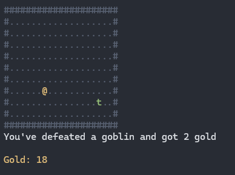

# NConio: Cross-Platform Console I/O Library

NConio is a single-header, cross-platform library designed to facilitate console
I/O operations similar to the classic `conio.h` in DOS. It aims to provide an
easy and intuitive API for tasks such as keyboard input handling, screen
coloring, and cursor positioning across Windows, macOS, and Linux.

## Features

- Color manipulation (foreground and background)
- Keyboard input without blocking (similar to `kbhit` in DOS)
- Cursor positioning and screen clearing
- Detecting console size changes
- Cross-platform support: Windows, macOS, Linux

## Getting Started

To use NConio in your project, simply include `nconio.h` in your source file. If
you define `NCONIO_IMPL` before including `nconio.h`, the implementation will be
included as well.

```c
#define NCONIO_IMPL
#include "nconio.h"
```

## Installation

No installation is required for Windows. For Linux and macOS, make sure
`ncurses` is installed and linked against your project.

### Linux

Install `ncurses` using your distribution's package manager. For example, on
Debian-based systems:

```bash
sudo apt-get install libncurses5-dev libncursesw5-dev
```

When compiling your project, link against `ncurses`:

```bash
gcc -o myproject myproject.c -lncurses
```

### macOS

macOS should have `ncurses` preinstalled. If you do encounter issues, you might
need to install it via Homebrew or ensure your environment is set up correctly
to find the ncurses library. Link against `ncurses` as you would on Linux.

## API Overview

- `void nconioinit(void)`: Initialize NConio (must be called first).
- `void nconiocleanup(void)`: Clean up resources used by NConio.
- `int kbhit(void)`: Check if a key has been pressed. Returns the key code or 0.
- `int putchr(int ch)`: Print a character to the console.
- `void putchat(char ch, int x, int y)`: Print character to console at position
  x, y
- `int getchr(void)`: Returns the character that was input.
- `char getchat(int x, int y);`: Get the character at position x, y
- `void gotoxy(int x, int y)`: Set the cursor position.
- `void clrscr(void)`: Clear the screen.
- `void textcolor(int color)`: Set the text color.
- `void textcolorreset(void)`: Reset text color to default.
- `void textbackground(int color)`: Set the background color.
- `void textbackgroundreset()`: Reset background color to default.
- `int wherex(void)`: Get current cursor X position.
- `int wherey(void)`: Get current cursor Y position.
- `int getconw(void)`: Get the console width in characters.
- `int getconh(void)`: Get the console height in characters.
- `int consizechanged(void)`: Check if console size has changed since the last
  call of consizechanged.
- `void hidecursor(void)`: Make the cursor invisible.
- `void showcursor(void)`: Make the cursor visible.

## Color Definitions

NConio provides a set of predefined color constants from `NCONIO_BLACK` to
`NCONIO_WHITE` to match the classic `conio.h` style.

```c
NCONIO_BLACK 0
NCONIO_BLUE 1
NCONIO_GREEN 2
NCONIO_CYAN 3
NCONIO_RED 4
NCONIO_MAGENTA 5
NCONIO_BROWN 6
NCONIO_LIGHTGRAY 7
NCONIO_DARKGRAY 8
NCONIO_LIGHTBLUE 9
NCONIO_LIGHTGREEN 10
NCONIO_LIGHTCYAN 11
NCONIO_LIGHTRED 12
NCONIO_LIGHTMAGENTA 13
NCONIO_YELLOW 14
NCONIO_WHITE 15
```

## Naive example of a rogue like game



```c
#define NCONIO_IMPL
#include "../nconio.h"

#include <stdio.h>
#include <stdlib.h>

/**
 * Naive rogue like game example using nconio.h
 */

int main(void)
{
    nconioinit();
    hidecursor();

    int x, y;               // map coords
    int px = 5, py = 5;     // player coords
    int tx = 11, ty = 7;    // goblin coords
    char map[21][11] = {0}; // map data
    int gold_total = 0;
    int gold_drop = 2;
    char action; // player action
    char wallch = '#';
    char actionmsg[100];

    do
    {
        // ESC
        if (action == 0x1B)
            break;

        if (action == 0x25 || action == 0x41) // arrow left || a
        {
            if (map[px - 1][py] != wallch)
                px--;
        }
        else if (action == 0x27 || action == 0x44) // arrow right || d
        {
            if (map[px + 1][py] != wallch)
                px++;
        }
        else if (action == 0x26 || action == 0x57) // arrow up || w
        {
            if (map[px][py - 1] != wallch)
                py--;
        }
        else if (action == 0x28 || action == 0x53) // arrow down || s
        {
            if (map[px][py + 1] != wallch)
                py++;
        }

        clrscr();

        // Goblin fight
        if (px == tx && py == ty)
        {
            tx = rand() % 19 + 1;
            ty = rand() % 9 + 1;
            gold_drop = rand() % 10;
            gold_total += gold_drop;
            sprintf(actionmsg, "You've defeated a goblin and got %d gold", gold_drop);
        }
        else
        {
            sprintf(actionmsg, "");
        }

        // Draw the map
        for (y = 0; y <= 10; y++)
        {
            for (x = 0; x <= 20; x++)
            {
                if (x == px && y == py)
                {
                    textcolor(NCONIO_BROWN);
                    printf("@");
                    textcolorreset();
                }
                else if (x == tx && y == ty)
                {
                    textcolor(NCONIO_GREEN);
                    printf("t");
                    textcolorreset();
                }
                else if (y == 0 || y == 10)
                {
                    textcolor(NCONIO_DARKGRAY);
                    printf("%c", wallch);
                    map[x][y] = wallch;
                    if (x == 20)
                    {
                        printf("\n");
                    }
                }
                else if (x == 0)
                {
                    textcolor(NCONIO_DARKGRAY);
                    printf("%c", wallch);
                    textcolorreset();
                    map[x][y] = wallch;
                }
                else if (x == 20)
                {
                    textcolor(NCONIO_DARKGRAY);
                    printf("%c\n", wallch);
                    textcolorreset();
                    map[x][y] = wallch;
                }
                else
                {
                    textcolor(NCONIO_DARKGRAY);
                    printf(".");
                    textcolorreset();
                    map[x][y] = '.';
                }
            }
        }
        textcolor(NCONIO_LIGHTGRAY);
        printf("%s\n\n", actionmsg);
        textcolor(NCONIO_YELLOW);
        printf("Gold: %d\n", gold_total);
        textcolorreset();
        printf("\n");
    } while ((action = getchr()));

    clrscr();
    textcolorreset();
    textbackgroundreset();
    nconiocleanup();
    return 0;
}
```

## License

NConio is open-source software distributed under the MIT license.
